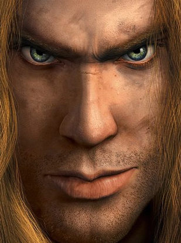

<!--
 * @Date: 2024-03-23 22:40:15
 * @LastEditors: zxh vocvocal@163.com
 * @LastEditTime: 2024-03-23 22:49:37
 * @FilePath: /img_fusion/README.md
-->
# 信息融合大作业1
## 拉普拉斯金字塔图像融合
- 依赖解决：
```
sudo apt install cmake gcc libopencv-dev
```
### 效果展示

原始图片：
   
   
   
融合后（15层塔）：

   
   